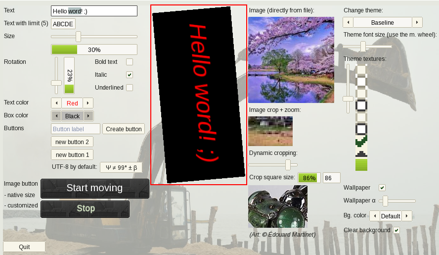

## *** UNFINISHED, EXPERIMENTAL, PROTOTYPE-QUALITY CODE! ***

- _The last version (0.6.0) was built against SFML@698f265 (and is incompatible with most other SFML versions!)._
- _A successor is being worked on, which will be published if/when sufficiently matured._

-------

sfw::GUI - A fork of "SFML Widgets", a small & simple SFML-based GUI
====================================================================

Original (upstream) author: Alexandre Bodelot <alexandre.bodelot@gmail.com>

License: [MIT License](http://opensource.org/licenses/MIT) (See the `LICENSE` file.)

## Changes to the original:

- Adapted to the upcoming SFML v3 API
- Richer, more flexible API, new features, improvements, bugfixes
- Default quick-start assets included (and removed the non-free ones)
- Windows build (MSVC & GCC (via [w64devkit](https://github.com/skeeto/w64devkit), so MingW should also work))
- Auto download & setup the latest SFML-master locally (mostly for GitHub workflows)
- Requires some C++23 features (e.g. std::expected)

## Main features:

- Moderately sized package with no external dependencies beyond SFML
- Simple, but versatile API
- Visual styling via spritesheets (small image files to customize borders, markers etc.)
- Optional callbacks for widget updates (supporting both `` and `` lambda signatures)
  _(Other event handlers can also be overridden via inheritance.)_
- Easy layouts: automatically (and dynamically re)positioned/sized widgets
- Translucent wallpapers, tooltips
- No CMake. (Well, since I never got to learn it, I just declare this a feature now. ;)
  Use e.g. TGUI if you don't feel warm and cozy without CMake.)

## Build

- Run `build` on Windows, or `make` on Linux, to create the lib + the example/demo/test executables.
- MSVC and GCC (both on Linux and w64devkit/MinGW) are auto-detected. (CLANG support has kinda rotted away by now.)
- The GCC option supports header auto-dependency tracking yet. (No working `clean` rule currently: delete `tmp/build` and the lib binaries under `lib/`)

_(See the Makefiles for options.)_

## Use

0. Integrate (via env. vars, or just copy) the `include` & `lib` dirs to your project.
   (Copy the `asset` dir, too, if you want to use the stock defaults.)
1. `#include "sfw/GUI.hpp"`.
2. Optionally (but typically) customize the theme: the styling texture image, font, colors etc.
3. Create the top-level GUI manager object, connecting it to your SFML window (like: `sfw::GUI myGUI(window);`),
   usually with your custom theme config (`sfw::GUI myGUI(window, myConfig);`)
4. Add containers (layouts) and widgets with `add(sfw::SomeWidget(...))`, or if you prefer: `add(new sfw::OtherWidget)` calls,
   set their properties (typically with method chaining, like `add(new TextBox)->set("hi")->setCallback(...)`) etc.
   _Note: widget objects will be managed (e.g. deleted) implicitly._
5. Pass events to the GUI (in your app's event loop): `myGUI.process(event);`.
6. Draw the GUI (in your frame refresh loop; i.e. the event loop in single-treaded apps): `myGUI.render();`.
7. Have fun!

## More...

* a [minimal example](src/examples/minimal_example.cpp)
* a fairly comprehensive example: [`demo.cpp`](src/examples/demo.cpp)
* see the headers in the [`include`](include/sfw) dir for an authoritative reference (most of them are easy to read)
